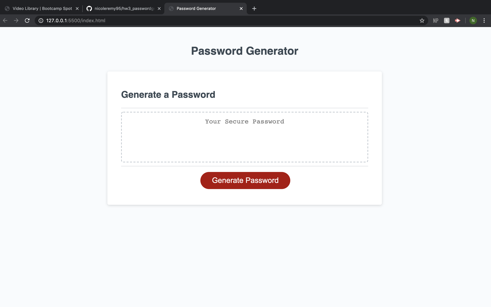

# hw3_passwordgenerator
passwordgenerate

In this project, I have created a password generator that will randomly choose a password given set criteria from the user. This will allow the user to use the resulting password to protect their sensitive data. 

When you click the generate password button, it will prompt you to specify the length between 8-128 characters. If you do not enter a value in this range, I have an alert that will tell the user it is not a valid answer, and while loop that will repeat the question. 

After this, it will ask you to confirm yes or cancel to the following questions; do you want to use upper case characters?, do you want to use lowercase characters?, do you want to use numbers?, do you want to use symbols? Each of these questions results in an array of values that will ultimately be put into the function to create the password. If the user answers "cancel" to all of these questions, an alert will tell the user to select at least one of characters, and a while loop will bring them to the beginning of the confirm section again. 

The resulting array will then by mixed, trimmed to the length specified by the user, and then the resulting array should be transferred into a string for the generate password function. 

## Images of Completed Website 

### Step 1

### Step 2

### Step 3

### Step 4

## Link to Site

Deployed website [password generator](https://nicoleremy95.github.io/hw3_passwordgenerator/)

## Contributing
Pull requests are welcome. For major changes, please open an issue first to discuss what you would like to change.

Please make sure to update tests as appropriate.

## License
[NER](https://choosealicense.com/licenses/mit/)